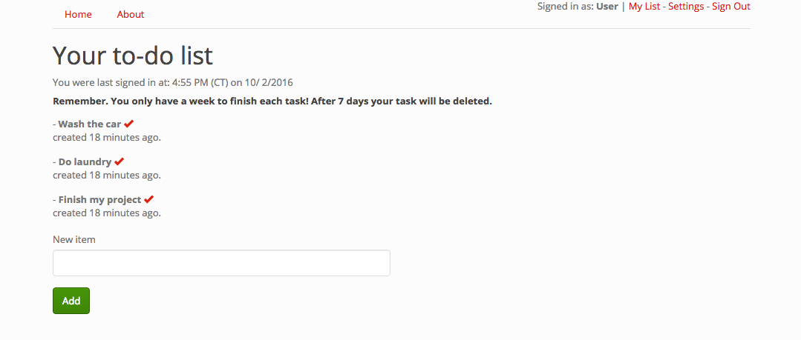

# Blocitoff

### Specs

Ruby Version: 2.3.x

Rails Version: 4.2.5

Authentication: Devise

Authorization: Custom

Test Suite: Minitest

Database: SQLite3

Other Dependencies: Bootstrap, Faker

Made with my mentor at [Bloc](http://bloc.io).
